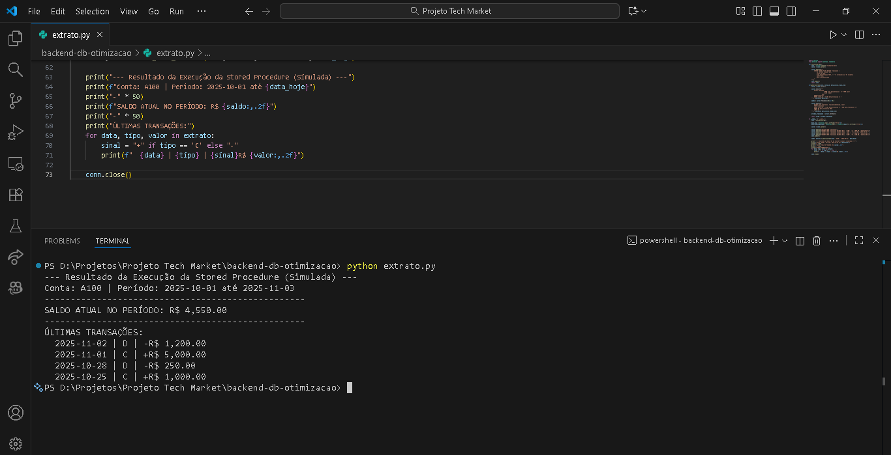

# 🐍 Otimização de Banco de Dados e Lógica de Saldo (Desafio Backend - TechMarket)

Este módulo simula a lógica de uma **Stored Procedure (Procedimento Armazenado)** utilizando Python e SQLite. O objetivo é demonstrar a capacidade de mover a lógica de cálculo de saldo e filtro de extrato para a camada de banco de dados, garantindo a **integridade transacional (ACID)** e otimizando a performance em um sistema de alto volume.

---

## 💡 Tecnologias Utilizadas

* **Python 3:** Linguagem de implementação da lógica transacional e conexão com o banco de dados.
* **SQLite3:** SGBD leve utilizado para armazenar as transações e executar as consultas otimizadas.
* **SQL:** Linguagem utilizada para a manipulação e consulta dos dados.

---

## ⚙️ Funcionalidades e Conceitos de Otimização

* **Integridade de Dados (ACID):** A lógica de saldo garante que cada transação é contabilizada corretamente de forma sequencial, simulando a integridade exigida em sistemas bancários.
* **Eficiência na Consulta:** O script aceita filtros por `data_inicio`, `data_fim` e `conta_id`, demonstrando como evitar o carregamento desnecessário de dados.
* **Lógica Cumulativa de Saldo:** Implementação do cálculo de saldo final no período, essencial para a validação contábil.
* **Simulação TOP N:** Uso de comandos SQL (`LIMIT`) para extrair apenas o volume de dados necessário (ex: as 10 últimas transações).

---

## 📸 Demonstração da Execução

O print abaixo demonstra o resultado da execução do script, mostrando o saldo final e a listagem ordenada das últimas transações no período:



---

## 🛠️ Como Executar

1. Navegue até a pasta `backend-db-otimizacao/`.
2. Certifique-se de ter o Python instalado.
3. Execute o script no terminal:
    ```bash
    python extrato.py
    ```
4. O script irá criar o arquivo `techmarket.db` (se não existir) e imprimirá o extrato no console.