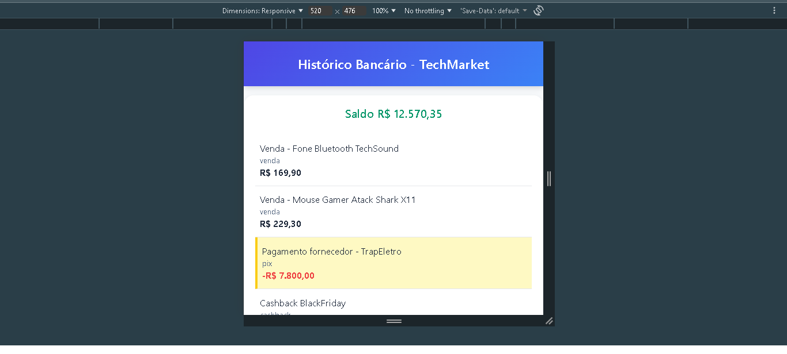

# 📊 Extrato Bancário Responsivo (Desafio UX/UI - TechMarket)

Módulo desenvolvido com foco em design *Mobile-First* para exibir o extrato de transações financeiras. O objetivo é apresentar os dados de forma clara e intuitiva em qualquer dispositivo, destacando transações de alto valor para melhor controle financeiro.

---

## 💡 Tecnologias Utilizadas

* **HTML5:** Marcação estrutural do extrato e dos elementos de saldo.
* **CSS3 (Puro):** Responsividade e estilização limpa. Uso de `flexbox` e `media queries`.
* **JavaScript (Vanilla JS):** Renderização dinâmica da lista de transações e aplicação de regras visuais.

---

## ⚙️ Funcionalidades e Otimizações

* **Mobile-First Design:** Priorização da experiência e layout para smartphones, escalando para telas maiores em seguida.
* **Destaque Condicional:** Implementação JavaScript para adicionar a classe `.destaque` em transações iguais ou superiores a **R$ 5.000,00**, facilitando a identificação de grandes movimentações.
* **Clareza Financeira:** Uso de cores distintas (vermelho/negrito) para saídas (`D` - Débito) e entradas (`C` - Crédito).
* **Usabilidade:** Listagem de transações com dados essenciais (data, tipo, valor) de fácil leitura.

---

## 📸 Visualização

A imagem abaixo demonstra a responsividade do extrato e a aplicação do destaque visual em transações de alto valor (>= R$ 5.000,00):

---

## 🛠️ Como Executar

1. Navegue até a pasta `frontend-extrato/`.
2. Abra o arquivo `extrato.html` no seu navegador.